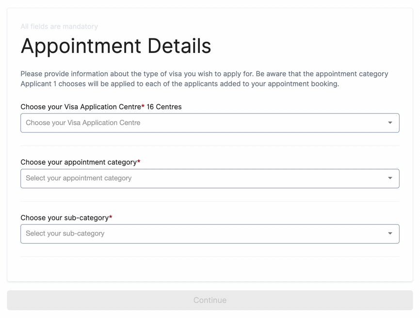

# VFS Germany Appointment Bot

A script to check the appointment slots.

By default, it runs every 2 minutes and check for visa slots at VFS website and notifies the user by SMS and call  
The interval can be changed in the config.

## How to use
1. Clone the repo: `git clone https://github.com/ranjan-mohanty/vfs-appointment-bot.git`  
2. Move into the repo: `cd vfs_appointment_bot`  
3. Update the config file (`config/config.ini`) with VFS and Twilio credentials
3. Create a new virtual environment: `python3 -m venv venv`  
4. Activate the environment (might differ a bit for windows and MacOS): `source venv/bin/activate`  
5. Install the dependencies: `pip install -r requirements.txt`  
6. Run the script: 

`python vfs_appointment_bot/vfs_appointment_bot.py '<vfs_centre>' '<visa_category>' '<visa_subcategory>'`

OR

`python vfs_appointment_bot/vfs_appointment_bot.py`

It will take the values as input from the user

** Please refer to the screenshot for more details regarding the inputs.

## Dependency
- Create an account on Twilio to get text and call alerts. Sign up [here](https://www.twilio.com/try-twilio) for a trial account to get credits upto worth $10.
- Install `geckodriver`

## How to install geckodriver

Run these the commands:

`wget https://github.com/mozilla/geckodriver/releases/download/v0.18.0/geckodriver-v0.18.0-linux64.tar.gz`

(You can find the download URL to the latest release of geckodriver on Github.)

Extract the file with

`tar -xvzf geckodriver*`

Make it executable (note this shouldn't be necessary, unless the unzipped file doesn't have the execute bits set):

`chmod +x geckodriver`

Add the driver to your PATH in ~/.bashrc so other tools can find it:

`export PATH=$PATH:/path-to-extracted-file/geckodrive`
